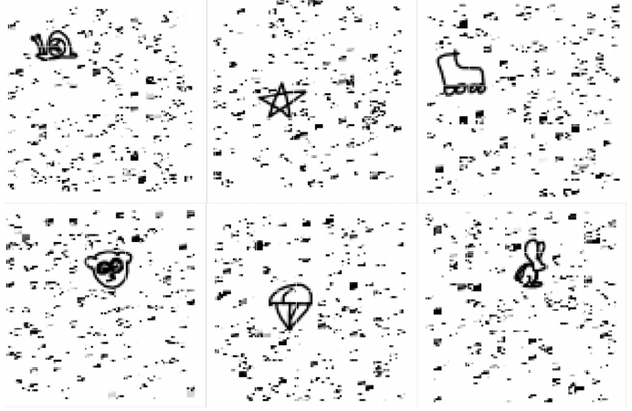

## Problem statement

The goal is to design a machine learning algorithm that can automatically identify hand drawn images as well as reason about their appearance. The dataset we have prepared is a variant of google’s quick draw dataset. For that dataset, a popular goal has been to simply classify the given human drawn images. There are 31 classes (pencil, rabbit, rollerskates,...)

We divide the code into separate 4 files:

PreprocessData.ipynb 
SVM.ipynb
NN.ipynb
CNN.ipynb

The first file preprocesses the data and output xTrain.npy, yTrain.npy and xTest.npy which will be used to train our models and make predictions.

- xTrain.npy is a 10,000x(38*38) matrix which contains all the preprocessed train images
- xTest.npy is a 10,000x(38*38) matrix which contains all the preprocessed test images
- yTrain.npy is a 10,000x1 matrix which contains all the train labels

The reason we do this is that so we can load and use them directly and we do not have to load the original files and rerun the preprocessing code. (We already outputted those 3 npy files so you won’t need to run PreprocessData.ipynb again)

The other 3 files will then load xTrain.npy, yTrain.npy and xTest.npy to train the model (using xTrain.npy and yTrain.npy) and make predictions on the test set (xTest.npy) then output to csv files.

To run the code:
For each file (except PreprocessData), run the code block ! unzip data.zip to extract xTrain.npy, xTest.npy and yTrain.npy. Then simply run each block of code. We labeled each section to indicate which code is doing which task.
For NN, the code can be run as is. There are different sections for different number of layers, so those can be run separately. The one layer Neural Network is currently running a large combination of hyper parameters, so it might be easier to run fewer one at a time, if you have time concerns. The rest of the layered Neural Networks are currently running just one set of hyper parameters, but can be easily adjusted to run more by simply adding to the “num_node_options” and “learning_rate_options” arrays.
